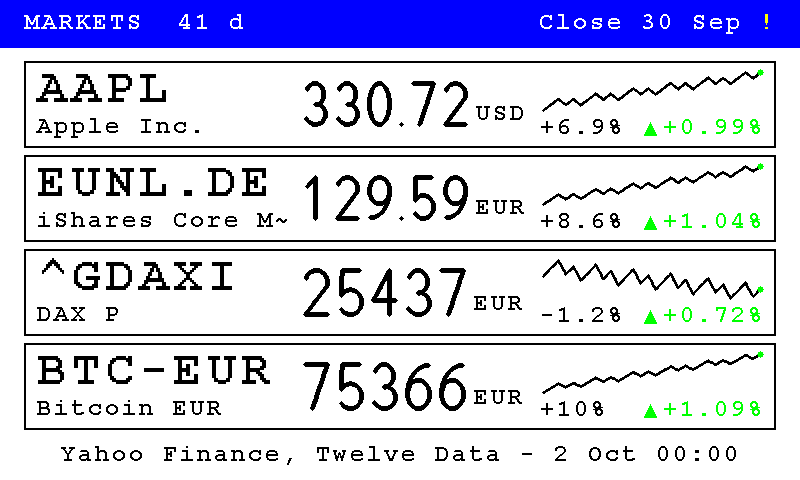

# Market quotes

> **Build option:** compiled in only with `python build.py --with market-quotes` (needs `info-screens`; the build pulls it in together with what it
> needs). Without it the firmware is the upstream firmware (see [FEATURES.md](FEATURES.md)).

A page for the [information screens](INFO_SCREENS.md) with the **prices of up to four symbols** - stocks, ETFs, indices, futures, crypto currencies
and currency pairs: the last price in big digits with its currency, the change against the day before (green up, red down) and a line of the last
30 days. It complements the [exchange-rate page](FINANCE_SNAPSHOT.md), which only knows the ECB's currencies.

*Sample data, drawn by the firmware's own code - [more pictures](SCREENSHOTS.md).*

## Settings

Settings -> Agenda -> Information screens: tick **Markets**, then

| Field | Meaning |
| --- | --- |
| Symbols | up to four, separated by commas, written the Yahoo way (see below); empty means `AAPL, EUNL.DE, ^GDAXI, BTC-EUR` |
| Use Yahoo Finance | on by default; switch it off if you only want the sources with a key |
| Twelve Data API key | optional, from twelvedata.com (free). **Write-only**: the frame never returns it, it is not in a normal settings export (only in the export that includes credentials), and a button removes it |
| Alpha Vantage API key | optional, from alphavantage.co (free). Write-only in the same way |

A key is letters and digits, 4 to 64 of them (real ones are 16 or 32; 4 lets the services' public `demo` keys through); anything else is not accepted (the form says so while you type, and the frame ignores it).

### Symbols

| Kind | Example | Notes |
| --- | --- | --- |
| Share | `AAPL`, `MSFT`, `BRK-B` | US shares as they are; the share class with a dash |
| Listing on another exchange | `EUNL.DE`, `VOD.L`, `SHOP.TO` | Yahoo's suffix: `.DE` Xetra, `.L` London, `.TO` Toronto, ... |
| Index | `^GDAXI`, `^GSPC` | Yahoo only |
| Future | `GC=F`, `CL=F` | Yahoo only |
| Crypto | `BTC-EUR`, `ETH-USD` | Yahoo and Twelve Data |
| Currency pair | `EURUSD=X` | Yahoo and Twelve Data; drawn with four decimals |

Letters are made upper case, doubles are dropped, a symbol that is not made of letters, digits and `. - ^ = _` (at most 15 characters) is left out.

## Where the prices come from

For each symbol the sources are tried in this order, and the first that answers wins:

1. **Yahoo Finance** (`query1.finance.yahoo.com/v8/finance/chart`) - no key, worldwide, all kinds of symbols. It is an **unofficial** interface: it may
   change, refuse or stop without notice, which is why it can be switched off and why the others exist.
2. **Twelve Data** (`api.twelvedata.com/time_series`) - free key, 800 requests a day; US shares and ETFs, currency pairs and crypto. No indices, futures or listings
   with an exchange suffix on the free plan.
3. **Alpha Vantage** (`www.alphavantage.co/query`, daily series) - free key, 25 requests a day; US shares and ETFs, and European and Asian listings by suffix
   (`.DE` -> `.DEX`, `.L` -> `.LON`, `.TO` -> `.TRT`, `.V` -> `.TRV`, `.BO` -> `.BSE`, `.SS` -> `.SHH`, `.SZ` -> `.SHZ`). No indices, futures, currency pairs or crypto.

A source is left out for a symbol when it is switched off or has no key, cannot serve that kind of symbol (the symbol is translated to the source's
notation where there is an equivalent: `BRK-B` -> `BRK.B`, `EURUSD=X` -> `EUR/USD`, `BTC-EUR` -> `BTC/EUR`), or its daily quota is used up. The frame counts its
own requests to the two quota-limited sources per day (UTC) and stops asking when the free quota would be exceeded.

A source that refuses the key, says "too many requests" or does not answer is left out for the rest of that draw; a symbol it does not know is only
skipped for that symbol. A wrong key never gets a second try in the same draw, and an answer is never asked for again (the shared HTTP helper retries
three times - this feature uses its own, which asks again only when the server did not answer at all; an HTTP error status such as the 401 of a wrong key counts as an answer).

## What the page shows

- A blue header with `MARKETS` (`KURSE`) and **the trading day of the newest price**, named so that it is not taken for today's date: `Close 30 Sep` (`Schluss 30.09.`;
  on a narrow panel just `30 Sep`). When every line covers the same time, the header says so after the heading: `MARKETS  41 d` (`KURSE  41 T`).
- A small yellow **`!`** behind the day says that the newest price is **older than the last trading day**: on Friday a price of Wednesday or older, on Monday one of Thursday or
  older (a bank holiday can show it too - the frame does not know the holidays).
- One row per symbol: the symbol big with its name under it (Yahoo gives the name; the other two do not, the last known one is kept), the price with its
  currency, the change against the day before in percent with an arrow, and the line of up to 30 days (the newest point is a dot in the colour of the trend) with **the
  change over the whole line** under it (`+6.9%`; the time it covers is in the header). All symbols use the same symbol size, the biggest at which the longest one fits.
- A symbol nobody could serve gets a row with `n/a`.
- **One footer line** with the sources the shown prices came from and when they were fetched: `Yahoo Finance, Twelve Data - 30 Sep 14:35` (`Quelle: ... - Stand 30.09. 14:35` where
  there is room; for a page drawn from the kept prices the time of the newest fetch). On a narrow panel it takes two or three lines. The lines are not shorter than that: the
  frame has one font size.
- If the lines of a page do not all cover the same time, each line says it itself under its chart (`29 d +10.2%`, as far as there is room).
- **Blue prices** are the last known ones: the fetch failed (or there was no network on this wake), so the price is taken from the last good answer that the frame kept
  on its storage (a text file, `.markets.txt`; answers older than 14 days are dropped). The footer then says `Blue = last known`.

### The newest price

Yahoo's daily bars sometimes lag behind: a bar without a close (a thinly traded ETF that did not trade) is left out, and the bar of a day that has just ended may not be complete.
So the frame also reads the **latest price Yahoo states for the symbol** (its `regularMarketPrice` and the time of it) and takes it as the newest point when that is of a later day
than the last bar - the close of the day before is then there at midnight, and during the day it is the live price. The page is drawn right after the fetch, so nothing older than
the fetch is shown; the log line `<symbol> from Yahoo Finance: 30 points, the newest of 2026-10-01` tells which day each chart ended on.

When a chart still ends on an older day, the yellow `!` says so:

*Friday 2 October, fetched at midnight, newest prices of Wednesday 30 September.*

If there is nothing to show the page says why: no network on this wake (and nothing kept), no source (Yahoo off and no key), or no source gave a price for any symbol.

## Notes

- The frame must be online when the page is drawn; it asks the sources once, at that moment, one request per symbol and source at most. With four symbols and
  the Agenda schedule at every few minutes this stays far below Yahoo's unpublished limits in practice, but a fast rotation can get the frame refused -
  a longer interval or the other sources help.
- The keys are never written to the log; the requests that hold them are cleared from memory after use, and the key is validated (letters and digits) before it goes into an address.
- The 30 points are the daily closing prices; the last point of a trading day is the latest price of that day, so during the day the change is against the previous close.
- The answers are read with the same care as elsewhere: Yahoo's and Twelve Data's as JSON, Alpha Vantage's one day at a time (its answer is about 21 KB) so that a cut-off answer still gives the newest days.
- The quotes are meant for a glance at the wall, not for trading: they may be delayed, and the sources' terms of use apply (Yahoo's interface is unofficial and for personal use).

## For developers

`main/market_quotes.c` (pure: symbol parsing, requests, the three parsers, quota, plan, cache; host tests in `host_tests/test_market.cpp` with real answers of all three
sources in `host_tests/data/market/`), `main/market_service.c` (the requests and the cache file on the device; `host_tests/test_market_service.cpp` runs it on the PC with the settings and the HTTP helper faked: fallback order, blocked sources, quota, cache), `main/screen_markets.c` (the page, pure drawing;
`host_tests/test_market_screen.cpp`), and the shared `json_scan.c` and `canvas_sparkline()`.
