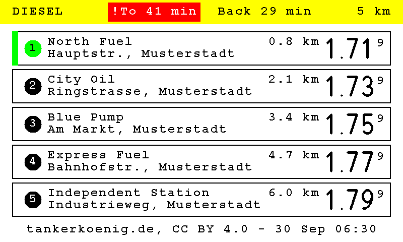

# Travel time on the fuel page

> **Build option:** compiled in only with `python build.py --with route-time` (needs `fuel-prices`; the build pulls it in with what it needs), part of
> the `extras` bundle and of every full build. Without it the firmware is the upstream firmware (see [FEATURES.md](FEATURES.md)).
>
> **Status:** built and tested on a PC, compiled for the boards, and run on one frame (Waveshare PhotoPainter 7.3", 2026-10-03) with a real **TomTom** key: the address
> look-up, the check of both directions (the frame's log: `Places checked: ... (TomTom)`) and the fuel page taking the travel time (`Travel time: ...`). **Not seen yet:**
> HERE (it is only asked when TomTom fails), a way that takes too long - the red block on the panel - and the provider terms of use. The test answers in
> `host_tests/data/route/` are still assembled from the providers' documentation. Please report what you see.

The header of the [fuel-price page](FUEL_PRICES.md) can show **how long the drive there and back takes right now**, with the traffic - for a
commute: to see in the morning whether a jam or road works make you leave earlier. A way that takes more than usual is drawn as a **red block with a
"!"**.

*Sample data, drawn by the firmware's own code: the way there takes 41 minutes (usual: 30), the way back 29. [More pictures](SCREENSHOTS.md).*

The travel time is **the traffic of the moment the page is drawn**. Let a schedule draw the page a little before you leave - with
[pages per schedule](SCHEDULE_PAGES.md) a schedule at 06:30 can always show the fuel page. The way back is also "right now": in the morning it
says little about the evening.

## Settings

Settings -> Agenda -> Information screens -> **Fuel prices** -> *Travel time in the header*:

| Setting | Default | What it does |
| --- | --- | --- |
| Show the travel time | off | Switches it on; the page without it is as before |
| Start address, destination address | empty | Typed as an address (street, house number, town). **Find** asks the service and offers the places it knows; you choose yours |
| Check the route and take over both places | - | The frame calculates the route both ways between the two places and takes them over only if it is believable (see below) |
| The usual time, there / back | the times of the first check | Minutes. Fill them from the last check (*Use the times now*), from the times **without traffic** (*Use the times without traffic*), or type your own |
| Longer by (%) | 10 | A way is red when it takes more than the usual time plus this percentage |
| and by (min) | 5 | ... **and** more than this many minutes more: a short way is not red for a minute of noise |
| Name on the display | empty | At most 10 letters, shown in front of the times where there is room. The display never shows the addresses |
| TomTom API key, HERE API key | empty | A free key of one or both (see below). **Write-only**: the frame never returns it, it is in an export only if the credentials are included |

Red needs both limits: with a usual time of 30 minutes, 10 % and 5 minutes, a way is red above 35 minutes; at 60 minutes above 66.

## How an address is taken over - and why it can be trusted

An address is turned into coordinates by the provider, once, when you take it over. Nothing is guessed afterwards:

1. **Find** shows what the provider found - only **addresses and streets** (a town, a district or a crossing is left out), best match first. If it
   finds nothing, you are told what to add (street, house number, town); a provider without a key, one that refuses the key and one that has no
   requests left are told apart too.
2. You **choose** the place that is meant. Nothing is stored yet.
3. **Check the route** calculates the route between the two places **both ways**; the answer must be believable: a time and a length above zero, not more
   than 12 hours, not shorter than the straight line between the places and not an absurd detour of it, and not the same place twice. Only then the frame stores
   the places (and what the provider called them) and marks them as checked. A place in the middle of a lake or a park, or a wrong town, usually fails here.
4. The frame stores the **coordinates**, so a provider other than the one that found the address routes the same points, and nothing is looked up again when
   the page is drawn.
5. If you change an address text afterwards, the place found for the old one is dropped: the page shows no travel time until the new one is checked.
   Without a check the frame never draws a travel time. The Web UI follows the same rule: a place is offered only for the text it was found for, so an address
   that is edited after **Find** has to be looked up again, and one that is edited after the check is shown as not taken over (and its times cannot be adopted) until it
   is checked again.

## Sources and keys

| | TomTom | HERE |
| --- | --- | --- |
| Needs | a free key from developer.tomtom.com (no credit card) | a free key from developer.here.com (no credit card, according to its pages) |
| Used for | the address search (Search API), the route with the traffic of now (Routing API) | the same (Geocoding & Search API, Routing API v8) |
| Order | first | second: asked when TomTom has no key, does not answer, refuses the key or has no requests left |

The free plans are far larger than what one page needs - two route requests per drawing, and a drawing is kept for five minutes. A key is **stored on
the frame**; the requests contain it and are **never logged**, nor are the addresses. The provider sees the **coordinates** of the two places and the frame's
IP address with every request: that is what the service is. Check the terms of use and any attribution the provider asks for before you rely on it.

## What the page shows

- In the header, between the fuel type and the radius: `Hin 28 min  Rück 31 min` (English `To 28 min  Back 31 min`). The heading gives way
  (`FUEL PRICES  DIESEL` becomes `DIESEL`) so that the words and the unit fit; on a narrow panel the form gets shorter (`28 / 31 min`, `28/31`), and the
  name of the route comes first where there is room.
- A way that takes more than usual is a **red block with white text and a "!" in front**; the other stays as it is.
- If the travel time cannot be had (no key, offline, the provider does not answer, the places are not checked) the header is as it was: **no old time is
  ever shown** - a jam of last night is worse than none. The reason is in the frame's log (`No travel time: ...`).

## Settings in the API

`GET/PATCH /api/config`: `route_enabled`, `route_from`, `route_to` (the texts), `route_from_found`, `route_to_found`, `route_checked` (read-only: set by the
check), `route_ref_there_min`, `route_ref_back_min`, `route_percent`, `route_min_excess_min`, `route_label`, and the keys `route_key_tomtom` and `route_key_here`
(write-only: `GET` answers only `route_key_*_configured`; `route_key_*_clear: true` removes one). Changing a text clears the check.

`POST /api/route/geocode` `{"text": "..."}` answers `{"status": "ok", "source": "TomTom", "places": [{"label", "lat", "lon", "level", "score"}]}` or a status
(`no_key`, `key_refused`, `quota`, `not_found`, `failed`) with the provider's words in `message` where it sends any. `POST /api/route/check` `{"from_text", "from": {place}, "to_text", "to": {place}}`
takes two places over and answers `{"status": "ok", "source", "there_min", "back_min", "free_there_min", "free_back_min"}` or a status (also `implausible`).

The **export** of the settings leaves the addresses out; only the export that includes the credentials ("Include credentials and URLs in export") keeps them and the keys.

## How it was checked

The pure code (the requests, the readers of the answers of both providers, the believable-route rule, the rule for a time that is too long) is host-tested with
answers assembled from the providers' documentation (`host_tests/data/route/`; the error answers of an invalid key were recorded from the live services), with a run
that cuts off and changes bytes of them; the device side (the order of the providers, the fallback, the five-minute memory, the places that are only taken over after the
check, no old time after a failure) is tested on the PC with the HTTP layer faked; the header is drawn on every panel size in both languages. On a frame (Waveshare
PhotoPainter 7.3") the endpoints answered, with a key of the right shape that no service knows, the way the providers answer an invalid key (both were asked, in order; the frame's log says
"the key was refused"), the Web UI card was driven in a browser (look-up, limits, name, keys, save; and, with the two route endpoints answered by a script, the choice among several places, an address edited
afterwards or while a check is on its way, and a frame that already holds checked places), and a fuel page was drawn with the travel time switched on but not checked: no
time, the page as before. With a real TomTom key on the same frame the address look-up (addresses, streets, up to five places, umlauts), the check of both ways and the
travel time of the fuel page worked. **Not seen yet:** a real answer of HERE, and the red block on the panel itself.
