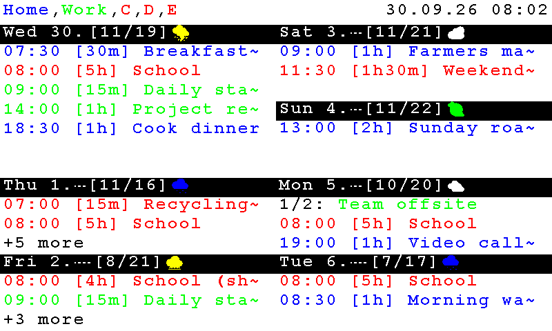
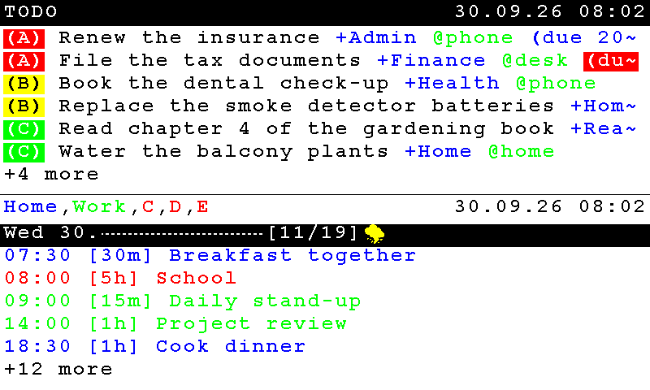
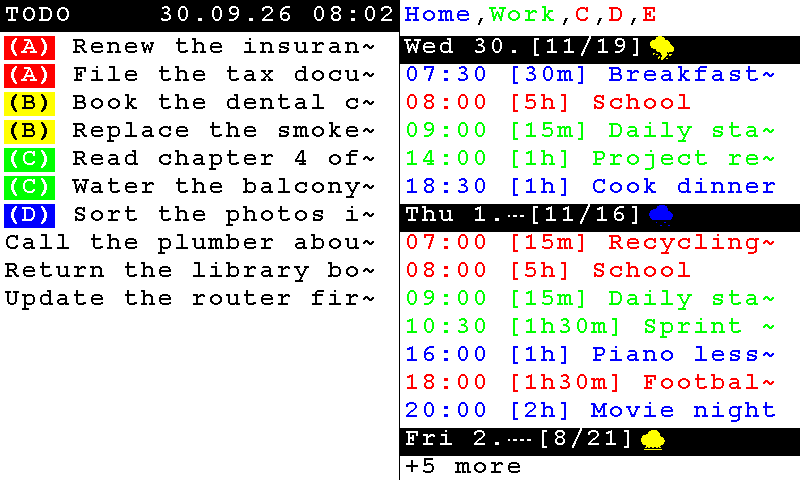
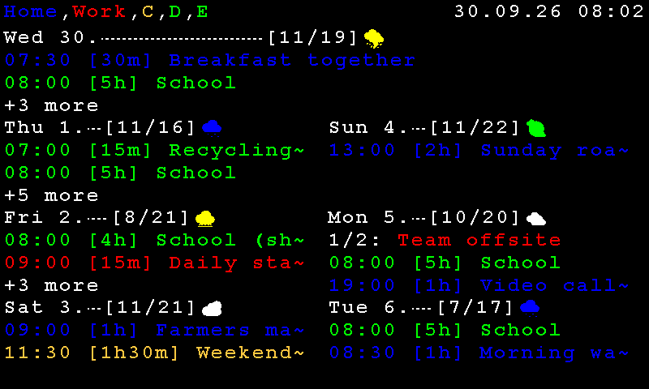
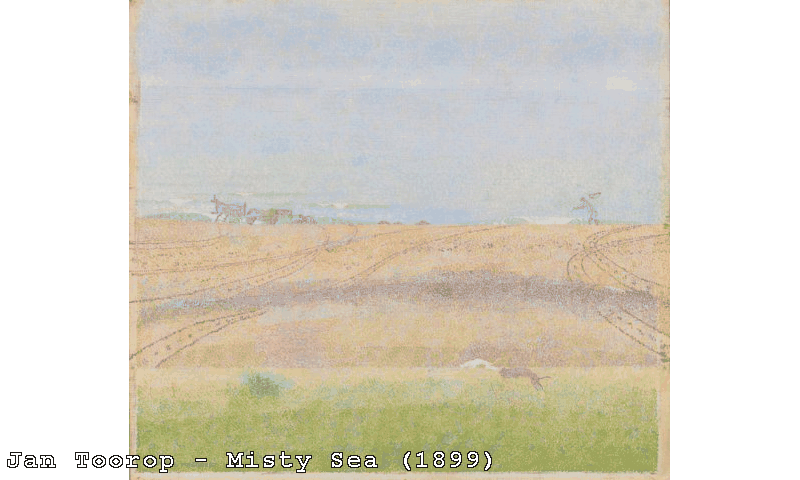

# What the frame shows

Pictures of what the display looks like: the Agenda in its layouts and in a colour profile, and each information page. Use them
to see what a feature does before you switch it on.

**How to read them.** The pictures are drawn by the firmware's own drawing code, on a PC, at 800 x 480 pixels (the Waveshare
PhotoPainter 7.3") - they are not photos of a panel. The data is made up (no real names, places or calendars) and the day is
fixed (Wednesday, 30 September 2026), so the pictures do not change from run to run. On the e-paper panel the colours are duller
than on a screen and are made of dots of the panel's few inks; the other boards have other sizes (480 x 800 portrait, 960 x 540,
1200 x 1600, 1872 x 1404), and every page is laid out again for each of them.

## The Agenda

The Agenda draws ToDo items and the events of up to five calendars (A-E) on the schedule you set in **Settings -> Agenda**.

### Calendar only: the 7-day grid

With only the Calendar column shown, **Settings -> Agenda -> Layout** chooses between a list of one to three days and two grids of
seven days. In **Template A** today takes the full width of the first row; the other six days follow in two columns. A row that
does not fit ends in `+3 more`. Each day's heading carries the forecast (low/high and an icon) when **Show forecast on day dividers** is on.


In **Template B** today is a double-height cell in the left column and the other six days share the rest, so today shows more
events:



### ToDo and Calendar together

With both columns shown, **Settings -> Agenda -> Appearance** puts them **stacked** (the ToDo list above the Calendar, the
default) or **side by side**. Portrait boards always stack. The ToDo rows are coloured by priority `(A)` to `(D)`, and a due date
turns red when overdue, yellow today and blue later; `+project` and `@context` tags have their own colours.





### A colour profile

The look of the Calendar column - page and heading colours, the colour of each calendar A-E, a marking colour - comes from a
**colour profile**: the one built into the firmware (the pictures above) or one of up to three you import under **Settings ->
Agenda -> Calendar Color Profiles**. This is the same week in the example profile 1 (white text on a black page); the three
example files are in [examples/waveshare_photopainter_73/color_profiles/](../examples/waveshare_photopainter_73/color_profiles/).



## Information pages

With `info-screens` (and the page's own option), other full-screen pages take turns with the Agenda on its schedule - see
[INFO_SCREENS.md](INFO_SCREENS.md). The pages with data from the internet end with a note when the data were fetched; the two
charts say how many days they cover.

| Page | Picture | More |
| --- | --- | --- |
| Chore wheel - who does which chore this week |  | [CHORE_WHEEL.md](CHORE_WHEEL.md) |
| Weather - today big, the next four days as rows |  | [WEATHER_SCREEN.md](WEATHER_SCREEN.md) |
| Fact of the day |  | [FACT_OF_THE_DAY.md](FACT_OF_THE_DAY.md) |
| Exchange rates (ECB reference rates) |  | [FINANCE_SNAPSHOT.md](FINANCE_SNAPSHOT.md) |
| Fuel prices (Germany) |  | [FUEL_PRICES.md](FUEL_PRICES.md) |
| Markets (stocks, ETFs, indices, crypto, currency pairs) |  | [MARKET_QUOTES.md](MARKET_QUOTES.md) |

### In German, with umlauts

The pages follow the frame's language (**Settings -> Overlays -> Overlay language**). With `glyphs`, **ä ö ü Ä Ö Ü ß** are drawn as
themselves ([GLYPHS.md](GLYPHS.md)):


## Artworks

The [artworks mode](ARTWORKS.md) shows a painting, drawing or print from a museum with a small caption at the bottom left:



*Jan Toorop, Misty Sea (1899), Rijksmuseum, public domain mark. The caption is drawn by the firmware's own code; the picture is not
dithered here, on the panel it is made of the panel's inks.*

## Drawing the pictures again

When the look of a page changes, the pictures have to be drawn again.

**The information pages** are drawn by `host_tests/render_screens.cpp`, which is part of the host tests ([host_tests/](../host_tests/)). It needs
a Linux or WSL shell with `cmake`, a C++ compiler and the libpng development files; the first run downloads GoogleTest and cJSON.

```sh
cmake -S host_tests -B build-host -DCMAKE_BUILD_TYPE=Release
cmake --build build-host --target render_screens -j

build-host/render_screens out chore-wheel-en 800x480       # writes out/chore-wheel-en_waveshare-800x480.png
build-host/render_screens out                              # every case in five panel sizes
```

| Picture in `docs/screens/` | `render_screens` case |
| --- | --- |
| `info-chore-wheel.png`, `info-weather.png`, `info-fact.png`, `info-fact-de.png` | `chore-wheel-en`, `weather-en`, `fact-en`, `fact-de` |
| `info-exchange-rates.png`, `info-fuel-prices.png`, `info-markets.png`, `info-markets-late.png` | `finance-en`, `fuel-en`, `markets-en`, `markets-late` |

The program knows more cases than are shown here (German variants, empty and error pages).

**The Agenda pictures** (`agenda-*.png`) and **the artworks picture** (`artworks-caption.png`: a public-domain painting, letterboxed, with
the real caption drawing) come from small programs that are not part of this repository. The Agenda pictures are the real `agenda_renderer.c` and colour-profile loader, run on a PC with made-up sources (a week of
events in five calendars, a ToDo list, a forecast) on the fixed day above. The small program that did it is **not part of this repository**, so
these six pictures cannot be redrawn from a checkout; the colour profile in `agenda-grid-a-profile.png` is
[color-profile-slot1-BW.json](../examples/waveshare_photopainter_73/color_profiles/color-profile-slot1-BW.json).

Keep the sample data made up: no real names, places, calendars or prices of real shops.
